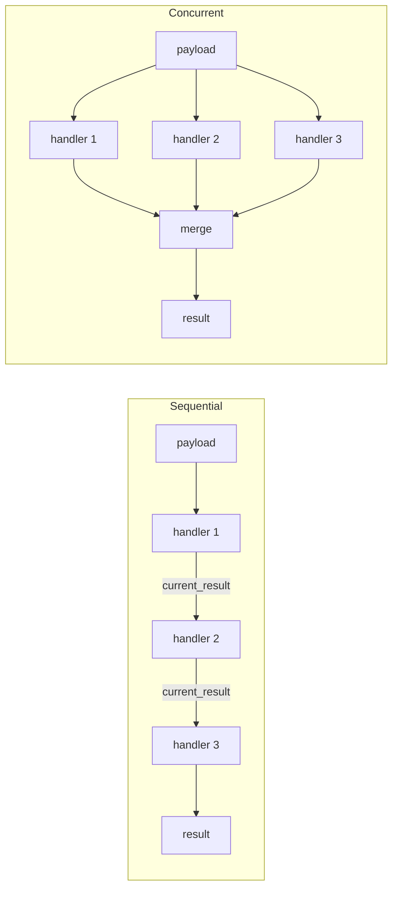

# Concepts

Understanding a few core concepts makes the rest of FineCode straightforward.

## Action

An **Action** is a named operation — `lint`, `format`, `build_artifact`, etc. For an accessible introduction to why the model is designed this way, see [Why the Action Model Works](theory/why-action-model.md).

```python
class LintAction(code_action.Action[LintRunPayload, LintRunContext, LintRunResult]):
    PAYLOAD_TYPE = LintRunPayload
    RUN_CONTEXT_TYPE = LintRunContext
    RESULT_TYPE = LintRunResult
```

Actions are identified by their **import path** (e.g. `finecode_extension_api.actions.lint.LintAction`), not by the name used in config. The config name is just a human-readable alias.

## Action Handler

An **Action Handler** is a concrete implementation of an action. Multiple handlers can be registered for a single action. For example, the `lint` action might have handlers for ruff, flake8, and mypy — each independently checking the code.

Each handler:

- specifies which **virtual environment** (`env`) it runs in
- declares its own **dependencies** (installed automatically by `prepare-envs`)
- receives the action payload and returns a result

### Sequential vs. concurrent execution

Handlers for an action run either **sequentially** (default) or **concurrently**.



**Sequential mode** (default): handlers run one after another. Each handler can read the accumulated result so far via `context.current_result`. Useful when handlers depend on each other's output (e.g. formatter → save-to-disk).

**Concurrent mode** (`run_handlers_concurrently: true`): all handlers run in parallel and results are merged afterward. Accessing `context.current_result` in concurrent mode raises `RuntimeError`. Useful for independent linters.

## Service

A **Service** is a long-lived dependency that handlers (and other services) can request via dependency injection. The Extension Runner resolves services by type annotation and injects them into handler constructors.

Service bindings are declared by interface and implementation:

- `interface`: import path of the service protocol (e.g. `finecode_extension_api.interfaces.ihttpclient.IHttpClient`)
- `source`: import path of the implementation class
- `env`: virtualenv name to install the service dependencies into
- `dependencies`: packages to install for that service

Services are singletons per Extension Runner. `init()` runs on first use, and `DisposableService` instances are disposed when the last handler using them shuts down.

Service declarations merge by `interface`, so a project can rebind a preset's service by declaring the same `interface` in `pyproject.toml`.

```toml
[[tool.finecode.service]]
interface = "finecode_extension_api.interfaces.ihttpclient.IHttpClient"
source = "finecode_httpclient.HttpClient"
env = "dev_no_runtime"
dependencies = ["finecode_httpclient~=0.1.0a1"]
```

See the [Services reference](reference/services.md) for the list of built-in services and which presets or extensions provide them.

## Preset

A **Preset** is a Python package that bundles action and handler declarations into a reusable, distributable configuration. Users install a preset as a `dev_workspace` dependency and reference it in `pyproject.toml`:

```toml
[tool.finecode]
presets = [{ source = "fine_python_recommended" }]
```

A preset contains a `preset.toml` file that declares which handlers to activate for which actions. The user's `pyproject.toml` configuration is merged on top of the preset, giving the user full control to override, extend, or disable individual handlers.

### Handler modes

When configuring an action in `pyproject.toml`, you can control how your configuration relates to preset handlers:

- **`handlers_mode = "merge"`:** (default) your handlers are added to the preset's handlers.
- **`handlers_mode = "replace"`:** your handler list completely replaces the preset's handlers for that action.
- **`enabled = false` on a handler entry:** disables that specific inherited handler.

## Source Artifact

A **Source Artifact** is a unit of source code that build/publish-style actions operate on. It is identified by a **source artifact definition file** (for example `pyproject.toml` or `package.json`). This is what many tools call a “project”, but FineCode uses **source artifact** to be more concrete.

When a source artifact includes FineCode configuration — a `pyproject.toml` with a `[tool.finecode]` section — the Workspace Manager discovers it automatically under the workspace roots provided by the client. Some CLI flags and protocol fields still use the word “project” for compatibility.

### Source Artifact identification

The canonical external identifier for a source artifact is its **absolute directory path** (e.g. `/home/user/myrepo/my_package`). This is always unique, language-agnostic, and is what `list_projects` returns in the `path` field. All WM API consumers (LSP, MCP, JSON-RPC) use paths.

The human-readable **project name** is taken from the `[project].name` field in `pyproject.toml`. Names are unique within a workspace in practice (two packages with the same name would break dependency resolution), but paths are used in the API to eliminate any ambiguity. The CLI is the only interface that accepts names — it resolves them to paths before making API calls.

A source artifact may belong to a **workspace** — a set of related source artifacts, often a single directory root but sometimes multiple directories. FineCode handles multi-artifact workspaces transparently: running `python -m finecode run lint` from the workspace root runs lint in all source artifacts that define it.

## Workspace Manager and Extension Runner

FineCode has two runtime components:

### Workspace Manager (WM)

The `finecode` package. It:

- discovers projects and resolves merged configuration
- manages virtual environments (`prepare-envs`)
- exposes an **LSP server** to the IDE
- delegates action execution to Extension Runners

### Extension Runner (ER)

The `finecode_extension_runner` package. It:

- runs inside a purpose-specific virtual environment (e.g. `.venvs/dev_no_runtime`)
- imports and executes handler code
- communicates results back to the WM via LSP/JSON-RPC

The WM/ER split means handler dependencies never pollute the workspace Python environment.

## Environments

Each handler declares an `env` (e.g. `dev_no_runtime`, `runtime`). FineCode creates a separate virtualenv for each env name it encounters, and installs the handler's declared `dependencies` into it. `prepare-envs` automates this.

```toml
# Example: handler in pyproject.toml
[[tool.finecode.action.lint.handlers]]
name = "ruff"
source = "fine_python_ruff.RuffLintFilesHandler"
env = "dev_no_runtime"
dependencies = ["fine_python_ruff~=0.2.0"]
```

The env name is arbitrary — it's just a label FineCode uses to group handlers that share a virtualenv.
