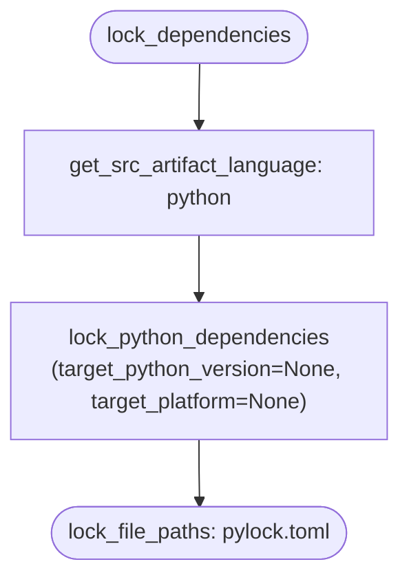
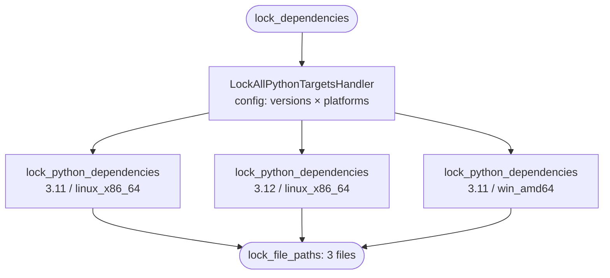
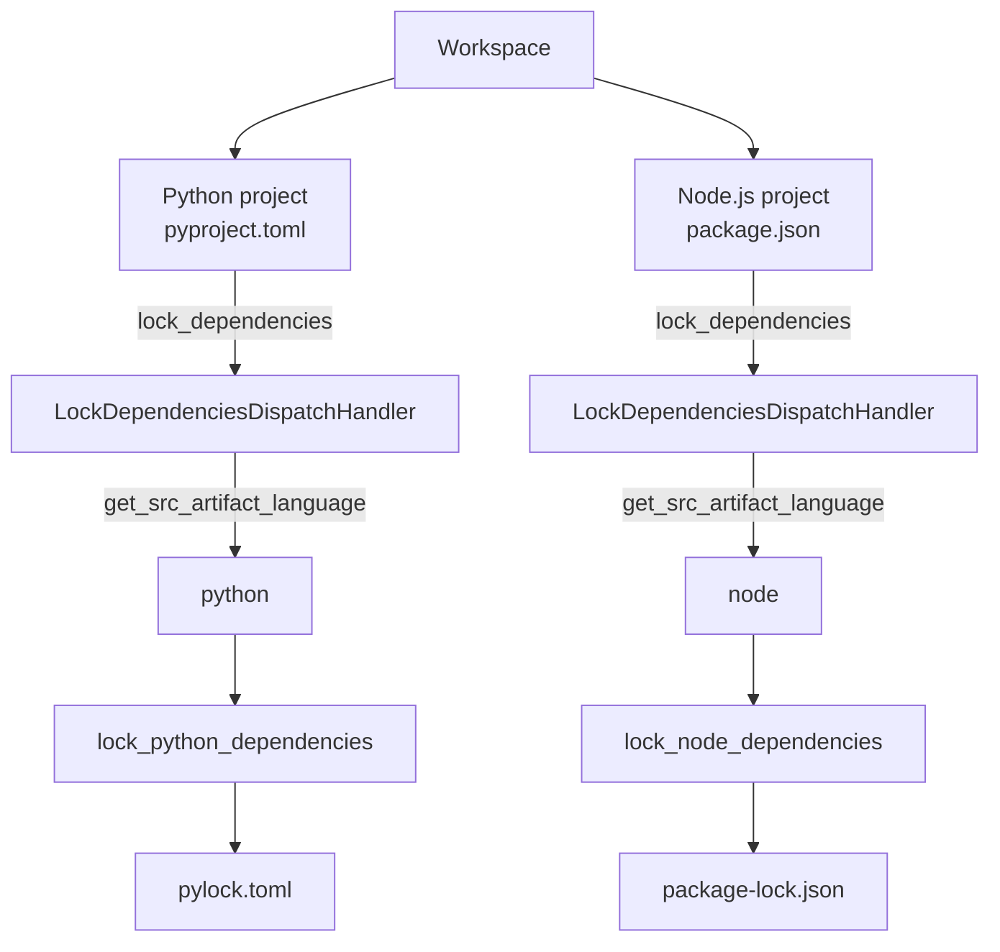

# Designing Actions

This guide covers the principles behind designing actions in FineCode — both for built-in actions and for actions you add in your own extensions or presets.

## Actions are inter-language

Action payloads and results should express concepts that are meaningful regardless of the programming language or ecosystem. A `LockDependenciesAction` should not contain a `target_python_version` field because an equivalent action for Node.js or Rust would have completely different (or no) equivalent parameters.

Keep the generic action payload to concepts that translate across all languages:

```python
# Good — meaningful in any ecosystem
@dataclasses.dataclass
class LockDependenciesRunPayload(code_action.RunActionPayload):
    src_artifact_def_path: pathlib.Path
    output_dir: pathlib.Path

# Avoid — Python-specific in a generic action
@dataclasses.dataclass
class LockDependenciesRunPayload(code_action.RunActionPayload):
    src_artifact_def_path: pathlib.Path
    output_dir: pathlib.Path
    target_python_version: str | None = None   # wrong level
    target_platform: str | None = None         # wrong level
```

## Cover different use cases, don't enforce a single model

Design actions to accommodate multiple valid workflows rather than assuming one tool's model. For example, Python lock files can be:

- **Per-platform** (pip-tools model): one lock file per `(python_version, platform)` combination, generated by running the action multiple times
- **Universal** (uv model): one lock file with environment markers covering all platforms

An action that hardcodes either model would exclude the other. Instead, keep the action generic (`output_dir` is caller-controlled) and let the handler and its configuration determine which model to use.

## Prefer multiple focused actions over one overloaded action

When different use cases require genuinely different payloads or semantics, define separate actions rather than adding optional fields that only apply in some scenarios.

Optional fields that are only meaningful for certain tools or workflows are a sign that the action is trying to cover too much. A handler that ignores half the payload fields, or a payload where only some field combinations are valid, indicates the action boundary is in the wrong place.

## Language-specific subactions

When an action requires parameters that are **ecosystem-specific but tool-independent**, create a language-specific subaction rather than placing those parameters in handler configuration.

### The three levels of specificity

| Level | What it carries | Example |
|---|---|---|
| Generic action | cross-language concepts | `LockDependenciesAction`: `src_artifact_def_path`, `output_dir` |
| Language-specific subaction | ecosystem parameters | `LockPythonDependenciesAction`: + `target_python_version`, `target_platform` |
| Handler config | tool parameters | pip-compile handler: `generate_hashes`, header; uv handler: resolution strategy |

### When to create a language-specific subaction

Create a subaction when:
- There are parameters that apply to **all tools in an ecosystem** but not to tools in other ecosystems
- Users should be able to swap tools without reconfiguring ecosystem-level parameters
- The generic action's payload would need optional fields that are meaningless outside one language

The generic action can still exist as a base case — useful for ecosystems where handler config is sufficient, or as a conceptual anchor in the action hierarchy.

### Declaring the relationship

Language-specific subactions declare their target language and parent action via class-level attributes so that dispatch handlers can discover them reliably — without depending on the registered name (see [ADR-0008](../adr/0008-explicit-specialization-metadata-for-language-actions.md)):

```python
class LintPythonFilesAction(code_action.Action[...]):
    """Lint Python source files and report diagnostics."""
    LANGUAGE = "python"
    PARENT_ACTION = LintFilesAction
    PAYLOAD_TYPE = LintFilesRunPayload
    # ...

class LockPythonDependenciesAction(code_action.Action[...]):
    """Generate a pip-compatible lock file for a Python artifact's dependencies."""
    LANGUAGE = "python"
    PARENT_ACTION = LockDependenciesAction
    PAYLOAD_TYPE = LockPythonDependenciesRunPayload
    # ...
```

Both attributes are required for language-specific subactions. `LANGUAGE` alone is ambiguous (multiple generic actions may have Python specializations) and `PARENT_ACTION` alone doesn't tell the dispatch handler which language group to route to.

### Extended payload fields must have defaults

When a language-specific subaction extends the parent payload with ecosystem-specific parameters, those fields must have defaults that are meaningful for the dispatch case — typically `None` meaning "auto-detect from project configuration or environment":

```python
@dataclasses.dataclass
class LockPythonDependenciesRunPayload(LockDependenciesRunPayload):
    target_python_version: str | None = None   # None = running interpreter
    target_platform: str | None = None         # None = current platform
```

The dispatch handler constructs subaction payloads generically from the parent payload fields. Extended fields receive their defaults. Workflows that require specific values for ecosystem parameters must use a specialized handler on the generic action (e.g. `LockAllPythonTargetsHandler` with configured target versions) or invoke the language-specific action directly.

## Use case examples

### Single-lock setup (universal lock, e.g. uv)

A Python project generates one universal lock file. The user activates `LockDependenciesDispatchHandler` for `lock_dependencies`. The dispatch handler detects the language via `get_src_artifact_language` and calls `lock_python_dependencies` once — no platform targeting.



```toml
[[tool.finecode.action.lock_dependencies.handlers]]
name = "dispatch"
source = "finecode_builtin_handlers.LockDependenciesDispatchHandler"
env = "dev_workspace"

[[tool.finecode.action.lock_python_dependencies.handlers]]
name = "uv"
source = "fine_python_uv.UvLockHandler"
env = "dev_workspace"
```

### Multi-lock setup (per-platform locks, e.g. pip-compile)

A Python project needs separate lock files per Python version and platform. The user activates `LockAllPythonTargetsHandler` — a different handler for the same `lock_dependencies` action. It calls `lock_python_dependencies` once per configured target combination and collects all generated paths.



```toml
[[tool.finecode.action.lock_dependencies.handlers]]
name = "all_python_targets"
source = "fine_python_pip.LockAllPythonTargetsHandler"
env = "dev_workspace"
config.python_versions = ["3.11", "3.12"]
config.platforms = ["linux_x86_64", "win_amd64"]

[[tool.finecode.action.lock_python_dependencies.handlers]]
name = "pip_compile"
source = "fine_python_pip.PipCompileLockHandler"
env = "dev_workspace"
```

The single vs. multi-lock choice is made entirely by which handler is activated — no action changes required.

### Mixed-language workspace

A workspace with projects in different languages. Each project calls the same `lock_dependencies` action. The dispatch handler routes per-project based on language detection.



Adding support for a new language requires no changes to `LockDependenciesDispatchHandler` — registering a subaction with `PARENT_ACTION = LockDependenciesAction` and `LANGUAGE = "<lang>"` is sufficient. The dispatch handler discovers it automatically via `get_actions_for_parent`.

## Partial results and progress

For long-running actions, the default recommendation is: **use partial results when the caller can consume useful incremental result data, and use progress when the user benefits from seeing execution status. Often you want both.**

They solve different problems:

| Mechanism | What it carries | Typical use |
|---|---|---|
| Partial results | Incremental **result data** in the action's result shape | diagnostics per file, discovered tests, per-file formatting results |
| Progress | Execution **metadata** about the current run | "resolving dependencies", "12/50 files linted", "running tests" |

### When to use which

- Use **partial results** when intermediate data is already meaningful to the caller and can be merged into the final result cleanly.
- Use **progress** when the action may take noticeable time, even if there is nothing useful to return until the end.
- Use **both** for workspace-scale or multi-step actions such as linting, formatting, test discovery, or other orchestration-heavy runs.
- Use **neither** for short, atomic actions where extra streaming would add complexity without improving UX.

Examples:

- `lint` should usually use **both**: diagnostics can stream incrementally, and progress can show overall completion.
- `install_env` may use **progress only**: the user cares what stage the install is in, but partial result data may not be meaningful until completion.
- `dump_config` likely needs **neither**: it is short and returns one final value.

### Keep the two contracts separate

Partial results and progress are orthogonal:

- Partial results are part of the action's **result contract**.
- Progress is **metadata** about execution.

Do not put status messages into partial results just to show activity, and do not use progress updates to smuggle result data. If the client should be able to consume it as structured output, it belongs in the result. If it only helps the user understand what the action is currently doing, it belongs in progress.

### Progress must reflect the user's unit of work

When a user sees "file X formatted" or "file X linted", they expect **all** handlers to have been applied to that file — not that one particular handler finished its pass. The progress grain must match the user's mental model, not the handler execution model.

This has a direct consequence on how multi-file, multi-handler actions structure their execution:

| Execution model | Handler order | Progress grain | User perception |
| --- | --- | --- | --- |
| **Per-item** (iterable payload) | All handlers run on file 1, then all on file 2, … | Per-file, after all handlers | "file X done" ✓ |
| **Per-handler batch** (flat payload) | Handler A on all files, then handler B on all files, … | Per-handler pass, or only at end | "handler A done" or no useful progress ✗ |

**Rule: when an action processes multiple items through multiple handlers and reports file-level progress, prefer the iterable payload model.** This ensures each partial result — and each progress step — represents a fully processed item.

The per-handler batch model is appropriate when handlers genuinely need the full file list at once (e.g. a whole-program analysis pass), or when there is only a single handler. But if the action chains several independent per-file tools (formatter A → formatter B → save), the iterable model gives correct progress semantics by construction.

**Corollary: single-tool handlers in an iterable-payload action should not report their own progress.** The parent action already advances progress after all handlers complete for each item. A handler reporting "processed file X" independently would be redundant at best — and misleading at worst, since from the user's perspective the file is not done until every handler has run. Handlers should focus on doing their work and returning a result; the orchestrating action owns the progress narrative.

### Action boundaries stay explicit

When one action delegates to another, neither partial results nor progress should be treated as something that "just flows through".

- A parent action that wants client-visible **partial results** must consume delegated partial results, map them into the parent's result shape, and re-emit them.
- A parent action that wants client-visible **progress** owns that narrative at its own boundary. Child handlers report progress for their own action scope; the parent should report parent-level stages itself.

This keeps the parent action in control of its client-facing contract. It also matches FineCode's WM behavior: multi-project requests aggregate progress at the WM level, while handler code remains action-scoped.

### How to implement partial results

If an action is designed to stream result data, use `RunActionWithPartialResultsContext` for its run context.

For **sequential orchestration**, prefer an async-generator handler that consumes delegated partial results with `run_action_iter()` and `yield`s mapped parent results:

```python
class LintHandler(
    code_action.ActionHandler[lint_action.LintAction, LintHandlerConfig]
):
    async def run(
        self,
        payload: lint_action.LintRunPayload,
        run_context: lint_action.LintRunContext,
    ):
        lint_files_action_instance = self.action_runner.get_action_by_source(
            lint_files_action.LintFilesAction
        )

        async for partial in self.action_runner.run_action_iter(
            action=lint_files_action_instance,
            payload=lint_files_action.LintFilesRunPayload(file_paths=file_uris),
            meta=run_context.meta,
        ):
            yield lint_action.LintRunResult(messages=partial.messages)
```

This is the preferred pattern because it keeps the orchestration logic the same whether partial results are active or not.

For **concurrent orchestration**, use the explicit sender from the run context when results become available outside a place where `yield` is practical:

```python
await run_context.partial_result_sender.send(
    lint_action.LintRunResult(messages=partial.messages)
)
```

Whichever pattern you use, each emitted partial result should already match the parent action's result contract and should merge cleanly via `RunActionResult.update()`.

### How to implement progress

Use `run_context.progress()` as an async context manager. It owns the begin/end lifecycle automatically, including error paths.

When you know the number of work items, pass `total=` and call `advance()`:

```python
async with run_context.progress("Linting files", total=len(file_uris)) as progress:
    for file_uri in file_uris:
        await lint_one_file(file_uri)
        await progress.advance(message=f"Linted {file_uri}")
```

When progress is **indeterminate** or stage-based, omit `total` and use `report()`:

```python
async with run_context.progress("Installing dependencies") as progress:
    await progress.report("Resolving dependency graph")
    await resolve_dependencies()

    await progress.report("Creating environment")
    await create_environment()

    await progress.report("Installing packages")
    await install_packages()
```

Recommendations:

- Prefer `advance()` for clear "N of M" work.
- Prefer short, user-facing messages that describe the current stage.
- Report parent-level milestones in orchestrators; do not rely on delegated child progress to describe the parent run.
- Avoid fake precision. If you do not have a meaningful total, keep progress indeterminate instead of inventing percentages.

## Documenting actions and fields

Action descriptions and field descriptions are read by the MCP server to populate AI assistant tool schemas. Write them as you write the action — they are the primary source of truth.

### Action description

Add a one-line class docstring to every `Action` subclass. It should describe what the action does from the caller's perspective — not implementation details or design rationale (those belong in module docstrings or comments).

```python
class LintAction(code_action.Action[LintRunPayload, LintRunContext, LintRunResult]):
    """Run linters on a project or specific files and report diagnostics."""

    PAYLOAD_TYPE = LintRunPayload
    RUN_CONTEXT_TYPE = LintRunContext
    RESULT_TYPE = LintRunResult
```

The docstring is read at runtime via `LintAction.__doc__` and exposed through the ER → WM → MCP pipeline as the `Tool.description`.

### Field descriptions

Add an **attribute docstring** — a bare string literal on the line immediately after a field assignment — to every `RunActionPayload` field that needs explanation. This is especially important for:

- Fields where an empty list or `None` has non-obvious semantics (e.g. "use handler defaults")
- Optional fields that are only meaningful in combination with another field
- Fields that accept free-form strings in a specific format

```python
@dataclasses.dataclass
class LintRunPayload(code_action.RunActionPayload):
    target: LintTarget = LintTarget.PROJECT
    """Scope of linting: 'project' (default) lints the whole project, 'files' lints only file_paths."""
    file_paths: list[Path] = dataclasses.field(default_factory=list)
    """Files to lint. Only used when target is 'files'. Empty list means lint the whole project."""
```

Attribute docstrings are extracted from source via `ast.parse()` in `schema_utils.py` and injected as `"description"` into the JSON Schema property for each field. They are the only form of field documentation readable at runtime — **inline comments are stripped by the Python parser and are invisible to the MCP layer**.

### What to write

- **Action docstring**: one sentence, active voice, caller-facing. "Run linters…", "Discover tests…", "Generate a lock file…"
- **Field docstring**: explain the semantics, not the type. Mention what the default means, what value combinations are valid, and any format constraints. Keep it to one or two sentences.

## FAQ

### Why not put ecosystem parameters in handler config?

If `target_python_version` lives in handler config, then switching from a pip-compile handler to a uv handler requires reconfiguring that parameter — even though it has nothing to do with the choice of tool. It is a property of the *target environment*, not the *tool*.

A language-specific subaction fixes this: both the pip-compile handler and the uv handler implement `LockPythonDependenciesAction`, and `target_python_version` is declared once in the payload. Swapping the handler only changes the tool-specific config.

```python
# Language-specific subaction — ecosystem parameters belong here
@dataclasses.dataclass
class LockPythonDependenciesRunPayload(code_action.RunActionPayload):
    src_artifact_def_path: pathlib.Path
    output_dir: pathlib.Path
    target_python_version: str | None = None   # e.g. "3.11"
    target_platform: str | None = None         # e.g. "linux_x86_64"

# pip-compile handler config — tool parameters belong here
@dataclasses.dataclass
class PipCompileLockHandlerConfig(code_action.ActionHandlerConfig):
    generate_hashes: bool = True
    allow_unsafe: bool = False

# uv handler config — different tool, same ecosystem parameters above
@dataclasses.dataclass
class UvLockHandlerConfig(code_action.ActionHandlerConfig):
    resolution: str = "highest"
```
