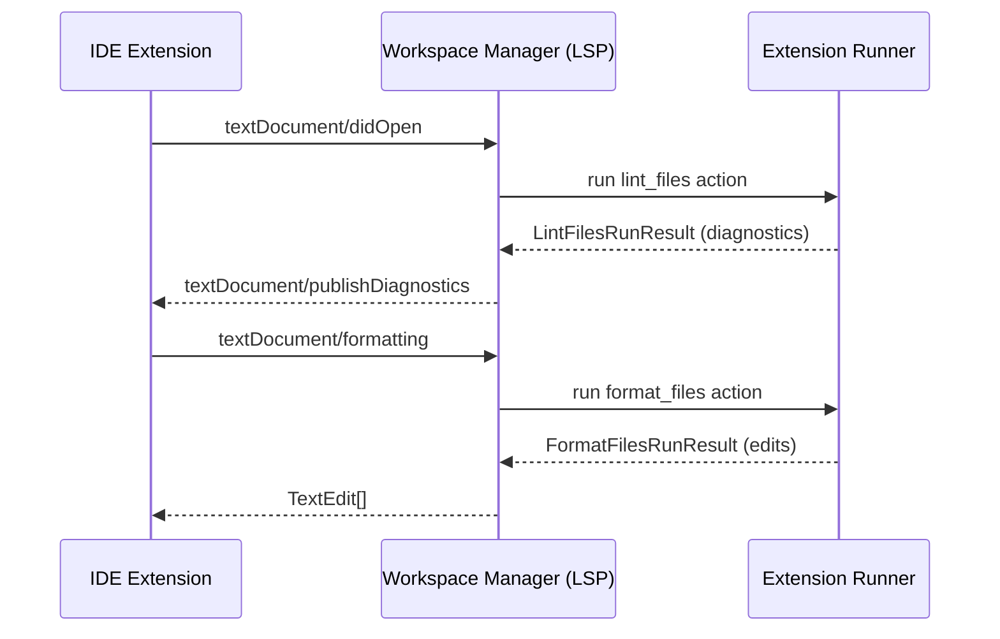

# LSP and MCP Architecture

FineCode uses one shared Workspace Manager Server (WM Server) for CLI, IDE (LSP), and AI-agent (MCP) clients.

## Component model

```text
FineCode WM Server (TCP JSON-RPC, auto-managed)
├── WorkspaceContext, runners, services
└── auto-stops when no clients remain

LSP Server (start-lsp, started by IDE)
└── connects to WM Server (starts one if needed)

MCP Server (start-mcp, started by MCP client)
└── connects to WM Server (starts one if needed)
```

The WM Server writes its port to `.venvs/dev_workspace/cache/finecode/wm_port` for client discovery.

## LSP request flow



The LSP layer translates protocol messages into FineCode actions, delegates execution to extension runners, then translates results back into LSP responses.

## Lifecycle behavior

- Any client (CLI, LSP, MCP) can start the WM Server if it is not already running.
- Each connected client keeps the WM Server alive.
- When the last client disconnects, the WM Server exits automatically.

## Manual server startup for debugging

Most users should not start servers manually. IDE and MCP clients usually manage startup automatically.

Use manual startup when:

- Debugging LSP/MCP behavior
- Developing a new IDE integration
- Developing a new MCP client integration

```bash
# LSP server (for custom IDE clients)
python -m finecode start-lsp --stdio

# MCP server
python -m finecode start-mcp
```

For setup instructions, see [IDE and MCP Setup](../getting-started-ide-mcp.md).
